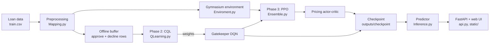

# Reinforcement Learning for Micro-Loan Underwriting

An end-to-end underwriting system that uses reinforcement learning to decide **whether to approve a loan** and, if approved, **what interest rate (APR) to quote**. The project covers data preprocessing, a custom Gymnasium environment, offline and online RL training, stress testing, a fairness audit, SHAP-based explanations, and a FastAPI web app for live scoring.

---

## Table of Contents

1. [Overview](#overview)
2. [How It Works](#how-it-works)
3. [Project Structure](#project-structure)
4. [Dataset](#dataset)
5. [Installation](#installation)
6. [Usage](#usage)
7. [Web App and API](#web-app-and-api)
8. [Model Details](#model-details)
9. [Evaluation, Stress Test and Fairness Audit](#evaluation-stress-test-and-fairness-audit)
10. [Explainability](#explainability)
11. [Outputs](#outputs)
12. [Limitations](#limitations)
13. [Tech Stack](#tech-stack)
14. [Author](#author)

---

## Overview

Lenders face two linked decisions for every applicant:

1. **Approve or decline?** Approving a loan that defaults is costly; declining a good borrower loses revenue.
2. **At what rate?** A higher APR earns more per loan but makes the borrower less likely to accept and attracts riskier applicants.

This project treats both as a reinforcement learning problem and solves them with a **two-stage cascade**:

| Stage | Role | Algorithm |
|-------|------|-----------|
| **Gatekeeper** | Approve or decline the applicant | Offline Conservative Q-Learning (CQL) on a DQN-style network |
| **Pricing engine** | Choose a continuous APR for approved applicants | Proximal Policy Optimization (PPO), actor-critic |

The reward also accounts for portfolio-level concerns: a penalty when the trailing default rate (GNPA) rises above 4%, and a penalty when the share of lending to a priority-sector proxy falls below 40%.

---

## How It Works



**Pipeline phases (run by `Main.py`):**

1. **Data ingestion and environment setup.** The raw CSV is cleaned and converted into a 17-feature state, and the custom environment appends 2 portfolio features, giving a 19-dimensional observation.
2. **Offline CQL warm start.** The historical file only contains funded loans, so each applicant is stored twice: once with the *approve* action (reward based on whether the loan defaulted) and once with the *decline* action (reward of zero). A Conservative Q-Learning loss then trains the gatekeeper without over-estimating actions the data does not support.
3. **Online PPO pricing.** The gatekeeper's weights are carried over. In the simulated environment, the gatekeeper filters applicants and PPO learns the APR to quote for those it approves.
4. **Validation and explainability.** A macroeconomic stress test, a segment-level approval audit, scoring of unseen applicants and a SHAP explanation of one decision.

---

## Project Structure

```
.
├── Main.py              # Runs the full training and validation pipeline
├── Mapping.py           # Dataset class: cleaning, feature engineering, scaling
├── Enviroment.py        # Custom Gymnasium environment (CustomEnv)
├── QLearning.py         # Offline buffer, Q-network and CQL training loop
├── Ensemble.py          # Gatekeeper, PPO actor-critic, cascade, stress test, audit, SHAP
├── Inference.py         # UnderwritingPredictor: save/load checkpoint, batch scoring
├── api.py               # FastAPI application (REST endpoints + static UI)
├── app.py               # Entry point exposing the FastAPI app
├── test_unseen.py       # Smoke test for a saved model on an unlabelled CSV
├── requirements.txt
├── Dataset1/            # train.csv, test.csv, Data Dictionary.xlsx (add your own copy)
├── static/              # Web UI: index.html, styles.css, app.js
└── outputs/
    ├── checkpoint/      # underwriting_model.pt, feature_scaler.joblib
    ├── unseen_predictions.csv
    ├── smoke_test_predictions.csv
    └── shap_explanation_<id>.html
```

---

## Dataset

The project uses a vehicle-loan dataset with a binary `LOAN_DEFAULT` label in the training file and an unlabelled test file. A `Data Dictionary.xlsx` describes the columns.

| File | Rows | Notes |
|------|------|-------|
| `Dataset1/train.csv` | 233,154 | Includes `LOAN_DEFAULT` (about 21.7% positive) |
| `Dataset1/test.csv` | 112,392 | Unlabelled, used for inference only |

Place your own copy of the files in `Dataset1/`. Because the test file has no labels, it supports inference checks but **not accuracy scoring**.

### Feature engineering (`Mapping.py`)

Ten continuous features are standardised with a `StandardScaler` fitted on the training data only:

- Log of disbursed amount and log of asset cost
- Loan-to-value ratio
- New-to-credit flag (credit score of 0)
- Normalised credit score, scaled from the 300–900 range
- Total active accounts (primary + secondary, capped at 20)
- Total overdue accounts (capped at 10)
- Inquiry velocity (capped at 10)
- Recent delinquencies in the last six months (capped at 5)
- Average account age in months

These are followed by:

- A **4-way one-hot customer segment**: salaried or self-employed, crossed with established credit or new-to-credit
- **Macro features**: repo rate, inflation assumption and a quarter index derived from the disbursal date

The environment then adds two **portfolio-tracking features**: trailing default rate (GNPA) and the priority-sector share of approvals.

---

## Installation

```bash
git clone https://github.com/TanyaMIshra14/<your-repo-name>.git
cd <your-repo-name>

python -m venv venv
# Windows
venv\Scripts\activate
# macOS / Linux
source venv/bin/activate

pip install -r requirements.txt
```

**Requirements:** `gymnasium`, `fastapi`, `joblib`, `numpy`, `pandas`, `plotly`, `scikit-learn`, `shap`, `torch`, `uvicorn[standard]`, `python-multipart`.

---

## Usage

### 1. Train the full pipeline

```bash
python Main.py
```

This reads `Dataset1/train.csv` and `Dataset1/test.csv`, trains both stages (seeded with `42` for reproducibility), runs the stress test and audit, saves the model to `outputs/checkpoint/`, writes predictions for the test file to `outputs/unseen_predictions.csv` and generates a SHAP report for the first applicant.

### 2. Smoke-test a saved model

```bash
python test_unseen.py
# optional arguments
python test_unseen.py --rows 100 --input Dataset1/test.csv --checkpoint outputs/checkpoint
```

The script checks that the prediction count matches the input, that Q-scores are finite, that the decision margin equals `APPROVE_Q_SCORE - DECLINE_Q_SCORE`, that approved APRs fall inside the 8–36% bounds and that declined applications carry no APR.

### 3. Score programmatically

```python
from Inference import UnderwritingPredictor

predictor = UnderwritingPredictor.load_checkpoint("outputs/checkpoint")
predictions, observations = predictor.predict_csv("Dataset1/test.csv")
print(predictions.head())
```

---

## Web App and API

Start the server (a trained checkpoint must exist in `outputs/checkpoint/`):

```bash
uvicorn app:app --reload
```

Then open **http://127.0.0.1:8000**. The interface ("Micro-loan Underwriting Lab") has two views:

- **Single application:** enter applicant, credit and account details to receive a decision, the Q-scores, the proposed APR and a ranked list of decision drivers.
- **Batch scoring:** upload a CSV and receive decisions for every row.

Both views include portfolio assumptions (current GNPA and priority-sector share) that feed into the model's state.

### REST endpoints

| Method | Endpoint | Description |
|--------|----------|-------------|
| `GET` | `/api/health` | Model-loaded status and whether explanations are available |
| `POST` | `/api/predict` | Decision and APR for one application (JSON body) |
| `POST` | `/api/predict-csv` | Batch decisions from an uploaded CSV |
| `POST` | `/api/explain` | Prediction plus SHAP factors and an HTML report |

Interactive API docs are available at `/docs`. Batch uploads are limited to **10 MB** and **10,000 rows**.

**Example request**

```bash
curl -X POST http://127.0.0.1:8000/api/predict \
  -H "Content-Type: application/json" \
  -d '{
    "application_id": "LIVE-001",
    "employment_type": "Salaried",
    "disbursal_date": "2018-10-15",
    "disbursed_amount": 55000,
    "asset_cost": 75000,
    "ltv": 74,
    "cibil_score": 720,
    "average_age_years": 2, "average_age_months": 3,
    "credit_history_years": 4, "credit_history_months": 0,
    "primary_active_accounts": 2, "secondary_active_accounts": 0,
    "primary_overdue_accounts": 0, "secondary_overdue_accounts": 0,
    "inquiries": 1,
    "recent_delinquencies": 0
  }'
```

**Example response**

```json
{
  "application_id": "LIVE-001",
  "decision": "APPROVE",
  "decline_q_score": 0.0,
  "approve_q_score": 0.0,
  "decision_margin": 0.0,
  "proposed_apr_percent": 0.0
}
```

*(Values shown are placeholders; the real numbers depend on the trained checkpoint.)*

---

## Model Details

### Environment (`Enviroment.py`)

| Item | Definition |
|------|------------|
| Observation | 19 dimensions (17 application/macro features + GNPA + priority-sector share) |
| Action | `(approve ∈ {0,1}, APR ∈ [0.08, 0.36])` |
| Episode length | 2,000 applicants drawn from a random starting point |

**Simulated borrower behaviour**

- *Acceptance:* the probability that a borrower accepts a quote falls as the APR rises, following a logistic curve centred at 18%.
- *Adverse selection:* APRs above 22% increase the effective default probability.

**Reward**

| Outcome | Reward |
|---------|--------|
| Decline | `0` |
| Approved but borrower rejects the quote | `-0.02` |
| Approved, accepted, defaulted | `-1` |
| Approved, accepted, repaid | `(APR − repo rate) × 3.5` |
| Trailing GNPA above 4% | additional `−5 × (GNPA − 0.04)` |
| Priority-sector share below 40% (after 20 approvals) | additional `−0.1 × (0.40 − share)` |

### Gatekeeper: offline CQL (`QLearning.py`)

- Network: MLP `19 → 128 → 128 → 2` with ReLU
- Offline buffer: 30,000 randomly sampled applicants × 2 actions = 60,000 transitions
- Offline approve reward uses an assumed APR of 18%
- Training: 3,000 steps, batch size 256, Adam (`lr = 3e-4`), CQL penalty weight `0.1`, soft target updates (`τ = 0.05`)
- Each applicant is independent, so every transition is one step with `γ = 0`, which makes this a contextual-bandit formulation of Q-learning

### Pricing engine: PPO (`Ensemble.py`)

- Shared backbone `19 → 64 → 64` with Tanh, a Gaussian actor head and a critic head
- The mean APR is passed through a sigmoid and rescaled into the 8–36% range
- Generalised Advantage Estimation (`γ = 0.99`, `λ = 0.95`), clip ratio `0.2`, 4 epochs per update
- 20,000 interaction steps; the policy updates each time 128 approved-loan transitions have been collected
- During training the gatekeeper uses ε-greedy exploration (`ε = 0.1`)

### Cascade

At inference time the gatekeeper compares `Q(approve)` with `Q(decline)`. If the applicant is declined, no APR is produced. If approved, the PPO actor's mean output becomes the proposed APR.

---

## Evaluation, Stress Test and Fairness Audit

`Main.py` runs two checks after training:

**Macroeconomic stress test.** Over 300 steps, the repo rate is raised by **125 basis points** at step 150. The test reports the total reward and the maximum portfolio GNPA reached.

**Segment-level approval audit.** Over 600 simulated applicants, the approval rate is reported for each of four customer segments (salaried or self-employed, with or without an established credit history) so that large gaps between groups are visible.

---

## Explainability

For any applicant, the project produces an HTML report built with **SHAP** and **Plotly** (see `outputs/shap_explanation_*.html`). SHAP is applied to the gatekeeper's *decision margin* (`Q(approve) − Q(decline)`) and the report shows:

- The decision, Q-scores and margin
- The factors pushing toward decline and toward approval
- A bar chart of the 12 most influential features

The explanation describes how the model used its inputs. It does not establish causality or fairness and is not a validated adverse-action reason code.

---

## Outputs

`unseen_predictions.csv` contains one row per test applicant:

| Column | Meaning |
|--------|---------|
| `UNIQUEID` | Applicant identifier |
| `DECISION` | `APPROVE` or `DECLINE` |
| `DECLINE_Q_SCORE`, `APPROVE_Q_SCORE` | Learned Q-values for each action (not probabilities) |
| `DECISION_MARGIN` | Approve score minus decline score |
| `PROPOSED_APR_PERCENT` | Quoted APR for approved applicants, empty otherwise |
| `PORTFOLIO_GNPA_INPUT`, `PORTFOLIO_PSL_SHARE_INPUT` | Portfolio assumptions used for the prediction |

In the included output file, 112,392 test applicants are scored, with about 71.7% approved.

---

## Limitations

- **Simulated environment.** Borrower acceptance, adverse selection and the reward weights are modelling assumptions, not observed behaviour. The policy is only as realistic as those assumptions.
- **Offline rewards are approximate.** Offline approve rewards use a fixed assumed APR (18%), and the macro inputs (repo rate, inflation) are fixed constants in `Mapping.py` rather than real time series.
- **Limited price differentiation.** In the included prediction output, approved applicants receive APRs in a narrow band (mean about 30%). The pricing policy would benefit from further tuning of the reward and exploration settings.
- **Priority-sector share is a proxy.** It is computed from the established-credit segments and should be redefined to match a real regulatory definition.
- **No labelled evaluation on the test set.** The test file has no outcomes, so approval quality on unseen data cannot be measured here.
- **Not a production credit system.** Fairness, compliance and model-risk review would be required before any real-world use.

---

## Tech Stack

**Language:** Python  
**Reinforcement learning:** PyTorch, Gymnasium (CQL, DQN, PPO)  
**Data and ML utilities:** NumPy, pandas, scikit-learn, joblib  
**Explainability and visualisation:** SHAP, Plotly  
**Serving:** FastAPI, Uvicorn, HTML/CSS/JavaScript front end

---

## Author

**Tanya Mishra**  
GitHub: [@TanyaMIshra14](https://github.com/TanyaMIshra14)
